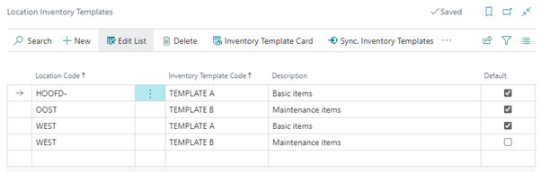

# Manual Inventory Templates
In Business Central, it can be a hassle to maintain Item planning parameters for multiple warehouses because you must use Stock Keeping Units (SKU) for each Item/Variant/Location combination and set them manually. The Inventory Templates app is especially beneficial if you have multiple locations with the same Item planning settings, for example, in service organizations with vans designated as Business Central locations.

This manual describes how to set up and use the Inventory Template app.

## Assigning Inventory Templates
Assigning Inventory Templates is done from the location Inventory Templates list. 
It can be opened from the menu (showing all locations) or from a location list or card:

Each location must have exactly one default template defined.

Next to the standard actions, there are two special actions:
* Inventory Template Card: opens the card of the current template.
* Sync. Inventory Templates: Start synchronization of Inventory Templates to SKU’s with a filter set with the same Location filter as in the list

[:arrow_left:](../README.md) [Back](../README.md)