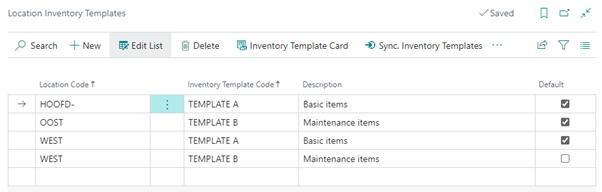

# Manual Inventory Templates

The Inventory Templates app lets you maintain item planning parameters for many Business Central locations at once by setting them up in templates and synchronizing those templates to stockkeeping units (SKUs).

## Assigning Inventory Templates

You assign templates to locations on the **Location Inventory Templates** page. You can open it in two ways:

- Search for **Location Inventory Templates** to see the templates of all locations.
- On the **Location List** or **Location Card**, choose **Location › Inventory Templates** to see only the templates of that location. The **Location Code** column is then hidden.

### Assignment fields

- **Location Code:** The location that the template is assigned to.
- **Inventory Template Code:** The template assigned to the location. You can assign several templates to one location, one per line.
- **Description:** The template description, filled in automatically.
- **Default:** Marks the template whose header settings are used for items that are in none of the location's templates. Each location needs exactly one default template.

### Actions

Besides the standard actions, the page has these actions:

- **[Inventory Template Card]:** Opens the card of the selected template in view-only mode.
- **[Sync. Inventory Templates]:** Synchronizes templates to SKUs. The synchronization filter is prefilled with the location filter of the page.

When you delete a location, its template assignments are deleted too.

### Messages

- **Location '…' has already a default inventory template '…':** Another template is already the default for this location. Clear **Default** for that template first.
- **No default inventory template set for location '…':** You started a synchronization for a location with no default template. Mark one of its templates as **Default**.

[:arrow_left:](../README.md) [Back](../README.md)
