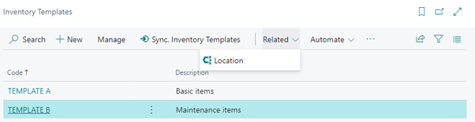
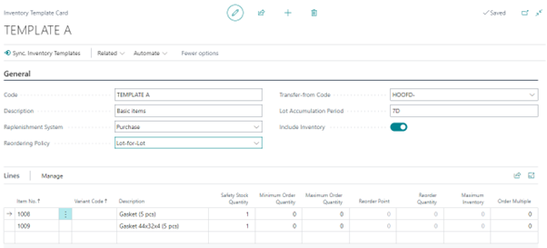

# Manual Inventory Templates
In Business Central, it can be a hassle to maintain Item planning parameters for multiple warehouses because you must use Stock Keeping Units (SKU) for each Item/Variant/Location combination and set them manually. The Inventory Templates app is especially beneficial if you have multiple locations with the same Item planning settings, for example, in service organizations with vans designated as Business Central locations.

This manual describes how to set up and use the Inventory Template app.

## Creating an Inventory Template
The available Inventory Templates are shown in the list:

Next to the standard actions there are two special actions:
* Sync. Inventory Templates: Start synchronization of Inventory Templates to SKU’s with a filter set on the current template
* Location: this shows a list of locations where the current template is assigned to.

From the list you can go to the Inventory Template card to create a new one or change an existing one:

The header contains the settings for all items in the list. Which parameters can be altered depends on the chosen reordering policy. Non-relevant parameters are disabled.
The fields have the identical function as on the SKU.

Next to the standard actions, there are two special actions:
* Sync. Inventory Templates: Start synchronization of Inventory Templates to SKU’s with a filter set on the current template
* Location: this shows a list of locations where the current template is assigned to.

[:arrow_left:](../README.md) [Back](../README.md)