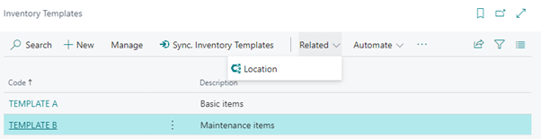
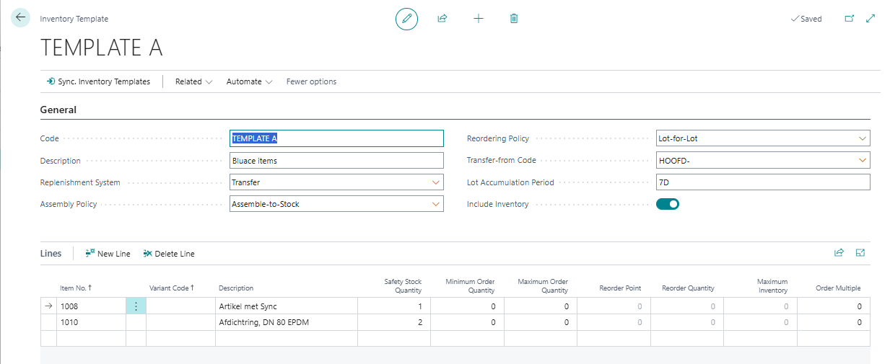

# Manual Inventory Templates

The Inventory Templates app lets you maintain item planning parameters for many Business Central locations at once by setting them up in templates and synchronizing those templates to stockkeeping units (SKUs).

## Creating an Inventory Template

### Inventory Templates list

Search for **Inventory Templates** to open the list of templates:

Besides the standard actions, the list has these actions:

- **[Sync. Inventory Templates]:** Synchronizes the selected template to SKUs. The synchronization filter is prefilled with this template.
- **Related › Location:** Shows the locations the selected template is assigned to.

Choose **[New]** to create a template, or open an existing template to change it. Both open the **Inventory Template** card.

### Inventory Template card

The **General** group holds the settings for every item in the template. The synchronization copies them to the SKUs. The **Reordering Policy** determines which fields you can edit, both here and on the lines. Fields that don't apply to it are disabled.

- **Code:** A unique code for the template.
- **Description:** A description of the template. It is also shown on the **Location Inventory Templates** page.
- **Replenishment System:** The type of supply order the planning system creates for the items: **Purchase**, **Transfer**, or **Assembly**.
- **Assembly Policy:** The default order flow for assembly items. You can only choose **Assemble-to-Order** when **Replenishment System** is **Assembly**.
- **Reordering Policy:** The reordering policy for the items. It determines which planning fields you can fill in.
- **Transfer-from Code:** The location that items are transferred from. This field is required when **Replenishment System** is **Transfer**. You can't select an in-transit location. The [Surplus Overview Report](surplus-overview-report.md) also sends recalled surplus to this location.
- **Lot Accumulation Period:** The period in which multiple demands are combined into one supply order when you use the **Lot-for-Lot** reordering policy, for example, `7D`. The value can't be negative.
- **Include Inventory:** Works the same way as the field of the same name on the SKU. You can only change it when the reordering policy supports it.

The card has the same **[Sync. Inventory Templates]** and **Related › Location** actions as the list.

### Template lines

On the **Lines**, you add the items that this template sets quantities for. The synchronization copies the quantities to the SKUs. When a location has several templates with the same item, the quantities are added up; see [How does it work](how-does-it-work.md#templates-and-locations).

- **Item No.:** The number of the item. You can only select items of type **Inventory** with **Sync. Inventory Template** switched on. When you change the item, the quantities on the line are cleared.
- **Variant Code:** The item variant. Leave it empty to set the quantities for the item without a variant. Each variant is synchronized to its own SKU.
- **Description:** The item description, filled in automatically.
- **Safety Stock Quantity:** The quantity to keep in stock to protect against supply and demand fluctuations during the replenishment lead time.
- **Minimum Order Quantity:** The minimum quantity for an order proposal.
- **Maximum Order Quantity:** The maximum quantity for an order proposal.
- **Reorder Point:** The inventory level below which the item must be replenished.
- **Reorder Quantity:** The standard lot size for all order proposals.
- **Maximum Inventory:** The maximum inventory level.
- **Order Multiple:** The planning system rounds the quantities of planned supply orders to a multiple of this value.

Every quantity must be a multiple of the item's **Rounding Precision**.

### Messages

- **Replenishment system '…' is not implemented with inventory templates:** You left the replenishment system empty or chose **Prod. Order**. Choose **Purchase**, **Transfer**, or **Assembly**.
- **Transfer-from Code may not be empty when Replenishment System is 'Transfer':** Fill in **Transfer-from Code** before you save a template with the replenishment system **Transfer**.
- **Inventory Template '…' cannot be deleted. It's in use on at least the Location Inventory Template…:** The template is still assigned to a location. Remove it on the [Location Inventory Templates](assigning-inventory-templates.md) page first. When you delete a template, its lines are deleted as well.
- **No rounding precision is defined for item '…':** The item's **Rounding Precision** is 0. Set it on the **Item Card** before you enter quantities.
- **Respect the rounding precision of '…' as set for the item:** The quantity is not a multiple of the item's **Rounding Precision**.

[:arrow_left:](../README.md) [Back](../README.md)
