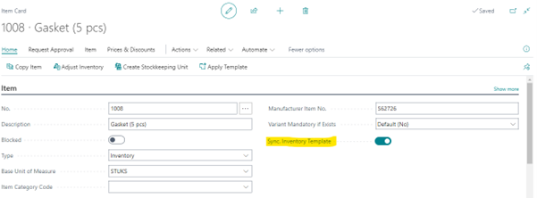
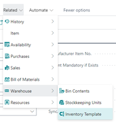

# Manual Inventory Templates
In Business Central, it can be a hassle to maintain Item planning parameters for multiple warehouses because you must use Stock Keeping Units (SKU) for each Item/Variant/Location combination and set them manually. The Inventory Templates app is especially beneficial if you have multiple locations with the same Item planning settings, for example, in service organizations with vans designated as Business Central locations.

This manual describes how to set up and use the Inventory Template app.

## Extended Item Functionality
Two new functionalities are added on the itemcard:
* A switch to disable an Item from Inventory Template synchronization:

 
The switch is default set to true.
* Action Inventory Template that shows a list of templates where the item is used:

[:arrow_left:](../README.md) [Back](../README.md)