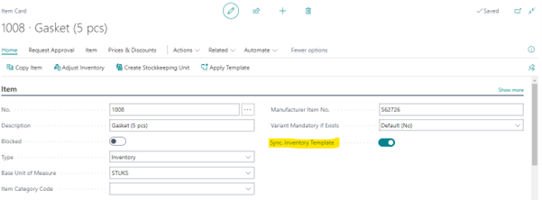
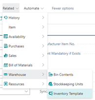

# Manual Inventory Templates

The Inventory Templates app lets you maintain item planning parameters for many Business Central locations at once by setting them up in templates and synchronizing those templates to stockkeeping units (SKUs).

## Extended Item Functionality

The app adds a switch to the **Item Card** and three actions to both the **Item Card** and the **Item List**.

### Sync. Inventory Template switch

The **Item** group on the **Item Card** has the **Sync. Inventory Template** switch:

- **Sync. Inventory Template:** Switch it on to include the item in the synchronization and to allow it on template lines. When it's off, the synchronization leaves the item's SKUs unchanged. You can only switch it on for items of type **Inventory**.

A new item has the switch off, unless you create the item from an item template that has it on. The **Item Template** card has the same **Sync. Inventory Template** switch.

### Actions

- **Actions › Functions › [Sync. Inventory Templates]:** Synchronizes the templates for the item the cursor is on. The synchronization filter is prefilled with that item. On the **Item List**, only that one item is synchronized, even when you select several items; to synchronize more items, set the **No.** filter on the synchronization page. See [Synchronizing SKUs](synchronizing-skus.md).
- **Actions › Functions › [Delete SKUs]:** Deletes all SKUs of the item, at every location, including SKUs that weren't created by the synchronization. On the **Item List**, it deletes the SKUs of all selected items.
- **Related › Warehouse › Inventory Template:** Shows the templates that contain the item:

### Messages

- **Item '…' is used in inventory templates:** You switched off **Sync. Inventory Template** for an item that is still on template lines. Remove it from those templates first.
- **For Item '…' field Sync. Inventory Template must be false when field Type not has value 'Inventory':** Only items of type **Inventory** can have the switch on. The same message appears on an item template.
- **Do you want to delete all stockkeeping units for the selected item(s)?:** Appears when you choose **Delete SKUs**. Choose **[Yes]** to delete the SKUs.
- **You successfully deleted … stockkeeping unit(s):** Confirms how many SKUs were deleted.

[:arrow_left:](../README.md) [Back](../README.md)
