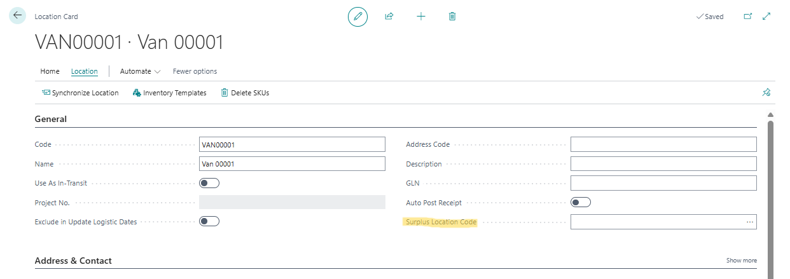

# Manual Inventory Templates

The Inventory Templates app lets you maintain item planning parameters for many Business Central locations at once by setting them up in templates and synchronizing those templates to stockkeeping units (SKUs).

## Extended Location Functionality

The app adds a field to the **Location Card** and two actions to both the **Location Card** and the **Location List**.

### Surplus Location Code field

The Location Card has the **Surplus Location Code** field on it:

- **Surplus Location Code:** The location whose surplus inventory the planning worksheet can use to replenish this location. You find this field in the **General** group. It can't be the location itself. See [Surplus Transfer](surplus-transfer.md).

### Actions

- **Location › [Inventory Templates]:** Opens the [Location Inventory Templates](assigning-inventory-templates.md) page for the location, where you can view or add its templates.
- **Location › [Delete SKUs]:** Deletes all SKUs at the location, including SKUs that weren't created by the synchronization. On the **Location List**, it deletes the SKUs of all selected locations.

### Messages

- **Location '…' cannot be the Surplus Location Code for itself:** Choose a different location as **Surplus Location Code**.
- **Do you want to delete all stockkeeping units for the selected location(s)?:** Appears when you choose **Delete SKUs**. Choose **[Yes]** to delete the SKUs.
- **You successfully deleted … stockkeeping unit(s):** Confirms how many SKUs were deleted.

[:arrow_left:](../README.md) [Back](../README.md)
