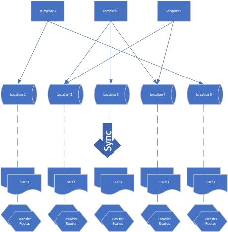

# Manual Inventory Templates
In Business Central, it can be a hassle to maintain Item planning parameters for multiple warehouses because you must use Stock Keeping Units (SKU) for each Item/Variant/Location combination and set them manually. The Inventory Templates app is especially beneficial if you have multiple locations with the same Item planning settings, for example, in service organizations with vans designated as Business Central locations.

This manual describes how to set up and use the Inventory Template app.

## How does it work
The Inventory Template app uses templates for maintaining item planning parameters. It supports replenishment systems Purchase and Transfer and all Reorder Policies. An overview is given in the following diagram.

It starts with creating Inventory templates. You can create templates, for example, for specific item groups, functions, jobs, resource groups, etcetera. Then you assign one or more templates to a location. If you assign more than one template to a location, these templates are combined, and if items are present in multiple templates, the quantities are summed up except for the order multiple, where the highest is taken. If Inventory Templates are combined that have different settings for Replenishmentsystem or Reorder policy, these cannot have mutual items. There must be at least one Inventory Template assigned to be the default. The 
header settings of this template will be used for items that are not present in any of the assigned templates for that location.

Once these settings are ready, it is time to start the synchronization of the templates to SKU’s (Stock Keeping Units) and Transfer routes. Per location SKU’s are created for each existing Item/Variant with parameters taken from the combined templates except for those Items that are disabled for Inventory Template Synchronization. If any of the assigned Inventory Templates has "transfer" as a replenishment system, transfer routes are also created for those locations.

In the Inventory Template app there is also a report available to see if there is surplus Inventory present according to the Planning parameters on the SKU’s. There is a Surplus if the inventory is higher than the minimum required inventory plus minimum order quantity plus demand present. The report also has the option to recall the surplus by creating transfer orders from the location with the surplus to the transfer-from location on the default template.

[:arrow_left:](../README.md) [Back](../README.md)