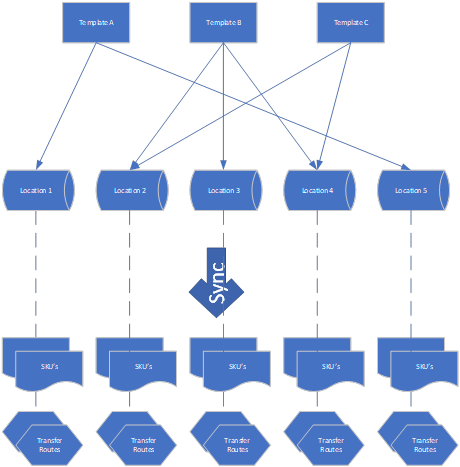

# Manual Inventory Templates

The Inventory Templates app lets you maintain item planning parameters for many Business Central locations at once by setting them up in templates and synchronizing those templates to stockkeeping units (SKUs).

## How does it work

In Business Central, you store item planning parameters per warehouse on stockkeeping units (SKUs): one for each item, variant, and location combination, each of which you set up by hand. When many of your locations share the same planning settings, for example, service vans that are set up as locations, that quickly becomes a lot of work. With the Inventory Templates app, you set the planning parameters up once in a template and apply them to every location that uses it.

You maintain item planning parameters in inventory templates. A template supports the replenishment systems **Purchase**, **Transfer**, and **Assembly**, as well as every reordering policy. The diagram below shows how templates, locations, SKUs, and transfer routes relate to each other.

### Templates and locations

You start by [creating inventory templates](creating-an-inventory-template.md), for example, per item group, function, job, or resource group. You then [assign one or more templates to a location](assigning-inventory-templates.md) and mark exactly one of them as the default.

When you assign more than one template to a location, the app combines them:

- **Items in several templates:** The quantities are added up, except **Order Multiple**, where the highest value is used.
- **Shared items:** An item can only be in more than one of the location's templates if those templates have the same **Replenishment System**, **Reordering Policy**, **Include Inventory**, **Lot Accumulation Period**, and **Transfer-from Code**.
- **Items that are in none of the templates:** These get the header settings of the default template, and all their quantity fields are set to zero.

### Synchronization

When your templates are ready, you synchronize them to SKUs and transfer routes. For each location, the app creates or updates an SKU for every item and item variant, using the combined template settings. Items with **Sync. Inventory Template** switched off are skipped. For templates with the replenishment system **Transfer**, the app also creates transfer routes in both directions between the location and the template's **Transfer-from Code**. See [Synchronizing SKUs](synchronizing-skus.md).

### Surplus inventory

The app also helps you find surplus inventory and put it to use:

- **[Surplus Overview Report](surplus-overview-report.md):** Shows where the inventory at a location is higher than its SKU planning parameters and open demand require, and can create transfer orders that send the surplus back.
- **[Surplus Transfer](surplus-transfer.md):** Lets you use the planning worksheet to replenish a location with surplus inventory from another location, instead of creating a new purchase.

[:arrow_left:](../README.md) [Back](../README.md)
