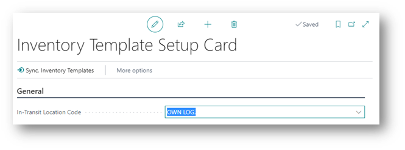

# Manual Inventory Templates
In Business Central, it can be a hassle to maintain Item planning parameters for multiple warehouses because you must use Stock Keeping Units (SKU) for each Item/Variant/Location combination and set them manually. The Inventory Templates app is especially beneficial if you have multiple locations with the same Item planning settings, for example, in service organizations with vans designated as Business Central locations.

This manual describes how to set up and use the Inventory Template app.

## Inventory Template Setup
There is a setup page for the Inventory Templates App:

There is one setting, the "in-transit location". Transfer routes between locations have this location as in transit location.
There is also an action present that starts the synchronization of the Inventory Templates to SKU’s. How this works in the section [Synchronizing SKU's](synchronizing-skus.md).

[:arrow_left:](../README.md) [Back](../README.md)