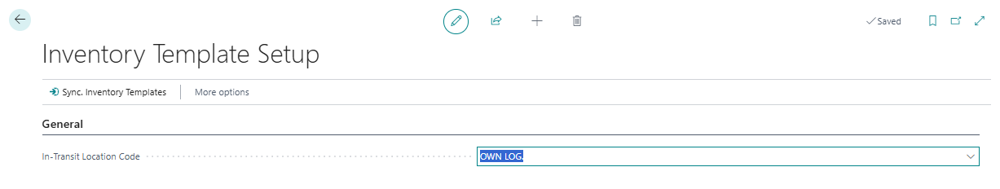

# Manual Inventory Templates

The Inventory Templates app lets you maintain item planning parameters for many Business Central locations at once by setting them up in templates and synchronizing those templates to stockkeeping units (SKUs).

## Inventory Template Setup

You set up the app on the **Inventory Template Setup** page. Search for the page, or open **Manual Setup** and choose it under the **Inventory Templates** category:

### Setup fields

- **In-Transit Location Code:** The in-transit location that the synchronization puts on the transfer routes it creates. Existing transfer routes between the same locations are updated to this location. You can only select a location with **Use As In-Transit** switched on. Fill in this field before you synchronize.

Choose **[Sync. Inventory Templates]** to synchronize all inventory templates to SKUs. See [Synchronizing SKUs](synchronizing-skus.md).

### Activate Product

Before you can use the app in a company, you must activate it there. Open **Assisted Setup** and, in the **Inventory Templates** group, choose **Activate product**. The step stays listed until the app is activated.

### Permissions

Users need the **Inventory Templates** permission set to work with inventory templates, the setup, the synchronization, and the Surplus Overview report. Assign it to the users or user groups that use the app.

### Messages

- **In-Transit Location Code must have a value…:** You started a synchronization while **In-Transit Location Code** is empty. Fill in the field and synchronize again.
- **Inventory Templates license is not valid or not activated:** You started a synchronization or the Surplus Overview report in a company where the app isn't activated. See [Activate Product](#activate-product).

[:arrow_left:](../README.md) [Back](../README.md)
