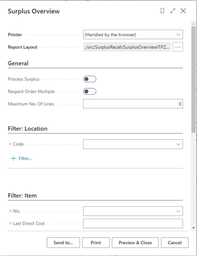
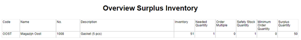

# Manual Inventory Templates

The Inventory Templates app lets you maintain item planning parameters for many Business Central locations at once by setting them up in templates and synchronizing those templates to stockkeeping units (SKUs).

## Surplus Overview Report

The **Surplus Overview** report shows where the inventory at a location is higher than its SKU planning parameters and open demand require. It can also create transfer orders that send the surplus back. Search for **Surplus Overview** to start it. The request page opens:

### Options

- **Process Surplus:** Switch it on to also create and release transfer orders that send the surplus from the location to the SKU's **Transfer-from Code**. The synchronization takes that code from the inventory template.
- **Respect Order Multiple:** Switch it on to round the surplus down to a multiple of the SKU's **Order Multiple**.
- **Maximum No. Of Lines:** The maximum number of lines per transfer order. When an order is full, the report starts a new one. When **Process Surplus** is on, enter a number greater than 0.

### Filters

- **Filter: Location – Code:** The locations to check. In-transit locations are always left out.
- **Filter: Item – No.** and **Last Direct Cost:** The items to check. Only items of type **Inventory** are included.
- **Filter: Stockkeeping Unit – Safety Stock Quantity** and **Date Filter:** Limit the SKUs to check.

The report only checks SKUs without a variant code.

### Surplus calculation

For each SKU, the report calculates:

- **Surplus Quantity:** **Inventory** minus the quantities on sales orders, service orders, and outbound transfer orders, plus the quantity on inbound transfer orders, minus **Safety Stock Quantity** and **Minimum Order Quantity**. When the SKU has no **Safety Stock Quantity**, **Minimum Order Quantity** is not deducted.
- **Needed Quantity:** **Inventory** minus **Surplus Quantity**.

Only SKUs with a **Surplus Quantity** greater than 0 appear in the report.

### Report output

The output, **Overview Surplus Inventory**, looks like this:

It shows one line per SKU with surplus: the location **Code** and **Name**, the item **No.** and **Description**, and the **Inventory**, **Needed Quantity**, **Order Multiple**, **Safety Stock Quantity**, **Minimum Order Quantity**, and **Surplus Quantity**.

### Messages

- **Maximum number of lines can not be zero when processing surplus:** **Process Surplus** is on and **Maximum No. Of Lines** is 0. Enter a number greater than 0.
- **Inventory Templates license is not valid or not activated:** The app isn't activated in this company. See [Activate Product](inventory-template-setup.md#activate-product).

[:arrow_left:](../README.md) [Back](../README.md)
