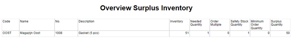

# Manual Inventory Templates
In Business Central, it can be a hassle to maintain Item planning parameters for multiple warehouses because you must use Stock Keeping Units (SKU) for each Item/Variant/Location combination and set them manually. The Inventory Templates app is especially beneficial if you have multiple locations with the same Item planning settings, for example, in service organizations with vans designated as Business Central locations.

This manual describes how to set up and use the Inventory Template app.

## Surplus Overview Report
This report gives insight into Surplus Inventory in specific locations based on the planning parameters set. When you start the report, the following request page is shown:

 
You can enter filters for Location, Item, and SKU. There are also three controls present with the following functions:

* **Process Surplus**: If this switch is on, the report will also create transfer orders to recall the surplus back to the Transfer-from location on the default Inventory Template.

* **Respect Order Multiple**: If switched on, recall quantities will be rounded down to the nearest order multiple.

* **Maximum No. Of Lines**: If you enter a number, the number of lines in a Transfer order will be limited to the given number per location.

The output of the report looks as follows:

[:arrow_left:](../README.md) [Back](../README.md)