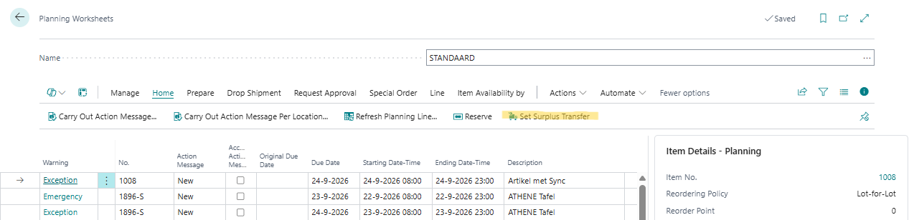

# Manual Inventory Templates

The Inventory Templates app lets you maintain item planning parameters for many Business Central locations at once by setting them up in templates and synchronizing those templates to stockkeeping units (SKUs).

## Surplus Transfer

When a location has a surplus location, the planning worksheet can replenish the location with surplus inventory from the surplus location, instead of creating a new purchase or assembly order. For this, the **Planning Worksheets** page has the **[Set Surplus Transfer]** action.

### Setting up a surplus location

On the **Location Card** of the location that needs the goods, fill in **Surplus Location Code** with the location that may have surplus. See [Extended Location Functionality](extended-location-functionality.md#surplus-location-code-field). The surplus location must have SKUs for the items; otherwise, their surplus can't be calculated.

### Setting surplus transfers in the planning worksheet

Calculate a plan on the **Planning Worksheets** page as usual. Filter the lines you want to check, then choose **[Set Surplus Transfer]**:

The action works on all lines in the current filter.

For each line whose replenishment system isn't **Transfer** yet, the app checks the SKU for the same item and variant at the surplus location of the line's location:

- **Enough surplus:** When the surplus, rounded down to the SKU's **Order Multiple**, covers the line quantity plus the quantities of the worksheet's other transfer lines from that surplus location for the same item, the line's **Replenishment System** changes to **Transfer**, and its **Transfer-from Code** is set to the surplus location.
- **Not enough surplus, or no SKU:** The line stays as it is.

The surplus is calculated the same way as in the [Surplus Overview Report](surplus-overview-report.md#surplus-calculation). Carry out the action messages as usual to create the transfer orders.

### Messages

- **Do you want to set surplus transfer for the … currently filtered line(s)?:** Appears when you choose **Set Surplus Transfer**. Choose **[Yes]** to check the lines.

[:arrow_left:](../README.md) [Back](../README.md)
