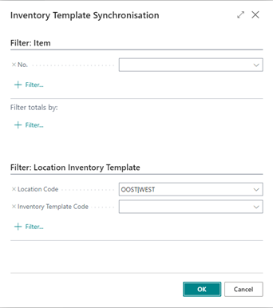

# Manual Inventory Templates
In Business Central, it can be a hassle to maintain Item planning parameters for multiple warehouses because you must use Stock Keeping Units (SKU) for each Item/Variant/Location combination and set them manually. The Inventory Templates app is especially beneficial if you have multiple locations with the same Item planning settings, for example, in service organizations with vans designated as Business Central locations.

This manual describes how to set up and use the Inventory Template app.

## Synchronizing SKU's
Synchronizing SKU’s can be started from several pages. The only difference is the prefilled filter. The filter page looks as follows:

The synchronization process can take some time, depending on the number of locations and items to do. 
However, you can use the filters to reduce the number of SKU’s that have to be synchronized if you know where you changed the Inventory Template settings

[:arrow_left:](../README.md) [Back](../README.md)