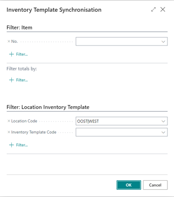

# Manual Inventory Templates

The Inventory Templates app lets you maintain item planning parameters for many Business Central locations at once by setting them up in templates and synchronizing those templates to stockkeeping units (SKUs).

## Synchronizing SKUs

### Starting the synchronization

You can start the synchronization from several pages. The only difference between them is the prefilled filter:

- **[Inventory Template Setup](inventory-template-setup.md):** No filter, so all templates are synchronized.
- **[Inventory Templates](creating-an-inventory-template.md#inventory-templates-list) list and Inventory Template card:** Prefilled with the selected template.
- **[Location Inventory Templates](assigning-inventory-templates.md):** Prefilled with the location filter of the page.
- **[Item Card and Item List](extended-item-functionality.md#actions):** Prefilled with the item the cursor is on. On the **Item List**, only that item is synchronized, even when you select several items.

Choose **[Sync. Inventory Templates]** on one of these pages. The **Inventory Template Synchronisation** page opens:

- **Filter: Item – No.:** The items to synchronize. Items with **Sync. Inventory Template** switched off are always left out.
- **Filter: Location Inventory Template – Location Code:** The locations to synchronize.
- **Filter: Location Inventory Template – Inventory Template Code:** The templates to synchronize.

Choose **[OK]** to start. A progress window shows the location and item being processed.

With many locations and items, the synchronization can take some time. If you know which templates, locations, or items you changed, set the filters to limit the work.

If an error occurs, the synchronization stops and none of its changes are saved. To synchronize everything that can be synchronized and get a list of the items that failed, use the [Synchronize Inventory Templates report](#synchronize-inventory-templates-report).

### What the synchronization does

For each location in the filter, and for each item and item variant in the filter, the synchronization does the following:

- **SKU:** Creates the SKU if it doesn't exist yet, starting from the item's own settings.
- **Header settings:** Copies **Replenishment System**, **Reordering Policy**, **Include Inventory**, **Lot Accumulation Period**, **Transfer-from Code**, and **Assembly Policy** from the templates that contain the item. If none of the location's templates contains the item, the settings of the default template are used.
- **Quantities:** Adds up the quantities from all the location's templates that contain the item, and takes the highest **Order Multiple**. If no template contains the item, the quantities are set to zero.
- **Costs:** Copies **Unit Cost**, **Standard Cost**, and **Last Direct Cost** from the item.
- **Transfer routes:** For templates with the replenishment system **Transfer**, creates transfer routes from the template's **Transfer-from Code** to the location and back, with the **In-Transit Location Code** from the [Inventory Template Setup](inventory-template-setup.md).

On an existing SKU, the synchronization keeps **Last Date Modified**. When the SKU's **Phys Invt Counting Period Code** stays the same, it also keeps **Last Counting Period Update**, **Next Counting Start Date**, and **Next Counting End Date**.

An existing SKU is only changed when one of its values differs. The synchronization never deletes SKUs. To remove them, use **Delete SKUs** on the [item](extended-item-functionality.md#actions) or the [location](extended-location-functionality.md#actions).

### Synchronize Inventory Templates report

The **Synchronize Inventory Templates** report runs the same synchronization item by item. When an item fails, the report skips it and continues with the next item. Search for **Synchronize Inventory Templates** to run it. You can also schedule it.

- **Item – No.:** The items to synchronize. Only items with **Sync. Inventory Template** switched on are included.
- **Location Inventory Template – Location Code:** The locations to synchronize.
- **Location Inventory Template – Inventory Template Code:** The templates to synchronize.

The output, **Sync. Inventory Templates - Error Log**, lists the **No.**, **Description**, and **Error Text** of every item that couldn't be synchronized.

### Messages

- **Conflicting inventory template settings for location '…', item '…' and variant '…':** The item is in more than one of the location's templates, and those templates have different header settings. See [How does it work](how-does-it-work.md#templates-and-locations).
- **No default inventory template set for location '…':** None of the location's templates is marked **Default**. See [Assigning Inventory Templates](assigning-inventory-templates.md).
- **In-Transit Location Code must have a value…:** The **In-Transit Location Code** in the [Inventory Template Setup](inventory-template-setup.md) is empty.
- **Inventory Templates license is not valid or not activated:** The app isn't activated in this company. See [Activate Product](inventory-template-setup.md#activate-product).

[:arrow_left:](../README.md) [Back](../README.md)
